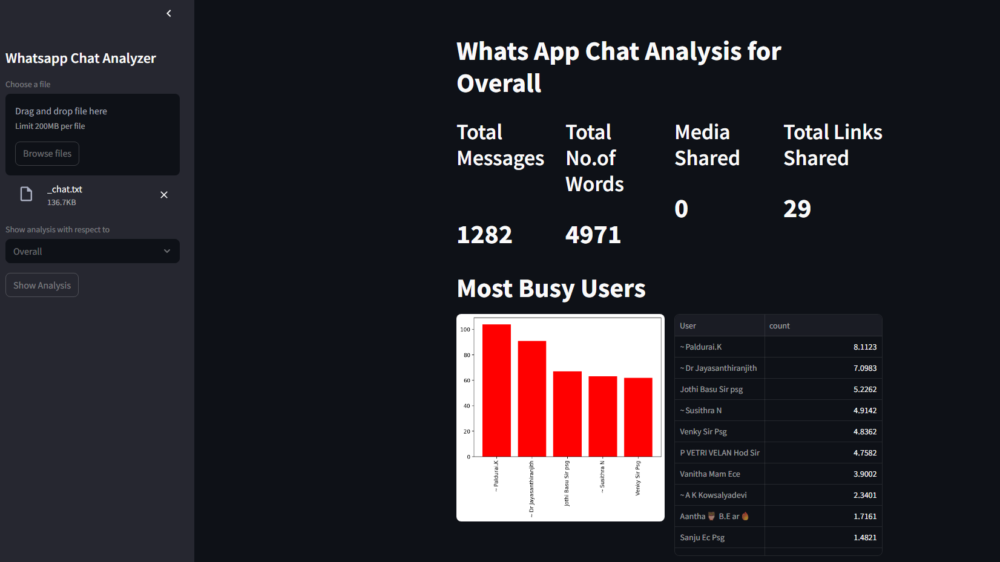
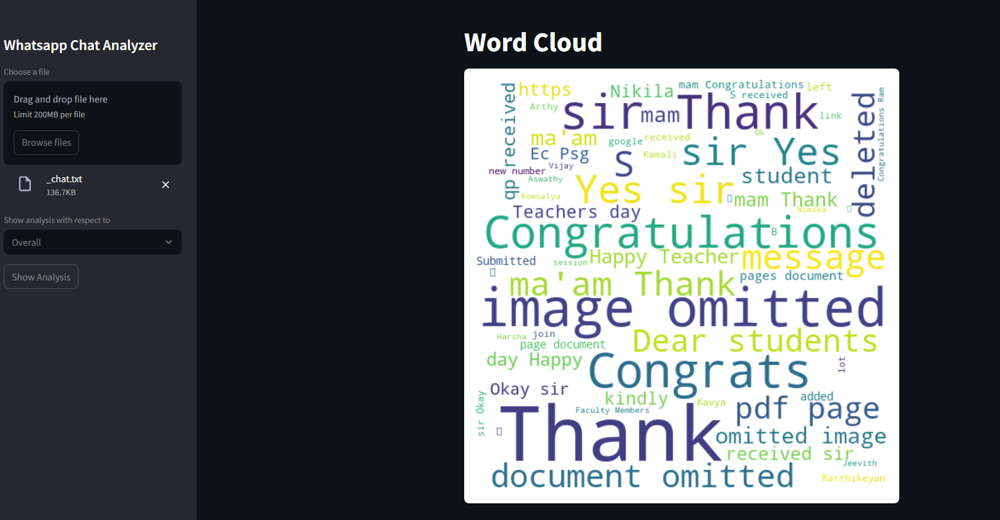
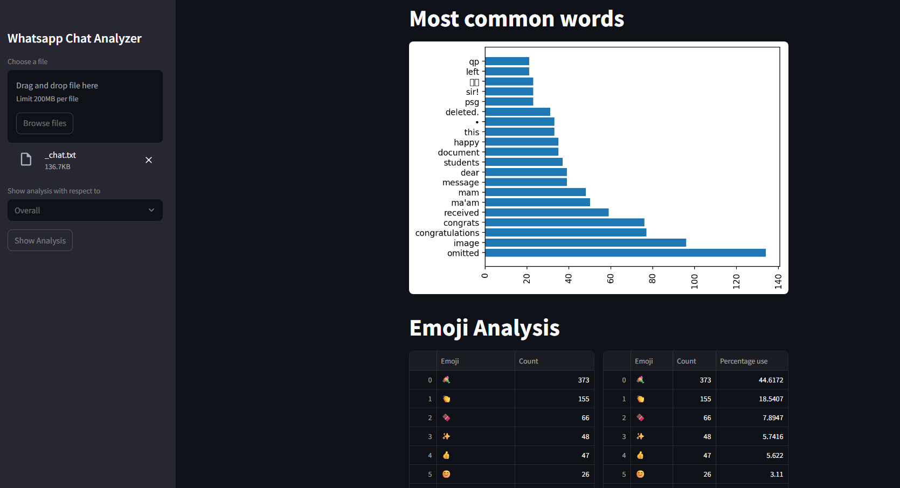
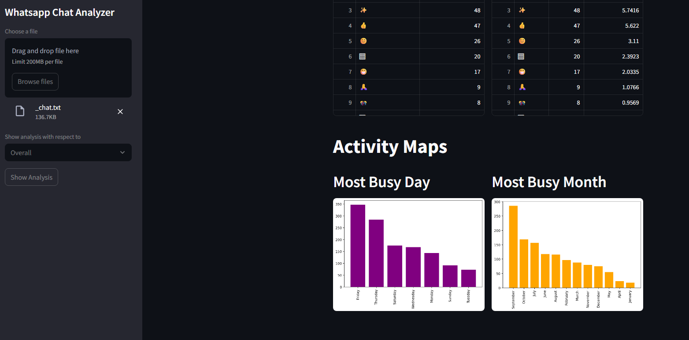

# 📊 WhatsApp Chat Analyzer

A **Streamlit** web app to analyze WhatsApp chat exports.  
Gain detailed insights into message counts, word usage, media sharing, emojis, activity timelines, and user behavior — all through interactive visualizations.

---

## 🎯 Features

- Upload WhatsApp exported chat text file (`.txt`)
- Analyze overall group or individual user statistics
- Summary metrics:
  - Total messages
  - Total words
  - Media shared
  - Links shared
- Identify the most active users in the group
- Word cloud of frequently used words
- Bar chart of most common words
- Emoji usage statistics with percentages
- Monthly and weekly activity timelines and heatmaps
- Clean, user-friendly interface with Streamlit

---

## 🖼️ Sample Outputs from the Streamlit UI
* I have just exported chat from whatsapp (without media) from one of my college groups for this analysis here.
<div align="center">

  
  
  
  

</div>

---

## 📁 Project Structure

```

/Code Files
├── app.py              # Main Streamlit app
├── preprocess.py       # Data preprocessing logic
├── stats.py            # Analysis & visualization functions
├── README.md           # This documentation
├── requirements.txt    # Python dependencies
└── .gitignore          # Files/folders to ignore in Git (e.g., .conda folder)

````

---

## 🚀 Installation

1. **Clone the repo**

```bash
git clone https://github.com/jowin-henry/WA-Chat-Analyser.git
cd WA-Chat-Analyser
````

2. **Create and activate a virtual environment (recommended)**

```bash
python -m venv venv

# Windows
venv\Scripts\activate

# macOS/Linux
source venv/bin/activate
```

3. **Install dependencies**

```bash
pip install -r requirements.txt
```

---

## ▶️ Usage

Run the app locally:

```bash
streamlit run app.py
```

* Upload your WhatsApp chat export `.txt` file using the sidebar.
* Select "Overall" or a specific user for analysis.
* Click **Show Analysis** to view detailed stats and visualizations.

---

## 📦 Dependencies

* Python 3.7+
* streamlit
* pandas
* matplotlib
* numpy
* wordcloud
* regex


---

## 📝 Notes

* The app expects WhatsApp exported chats in plain text format.
* Group notifications (e.g., "User added to group") are filtered out from user-specific stats.
* Monthly timelines use smart date formatting to avoid crowded x-axis labels.

---


